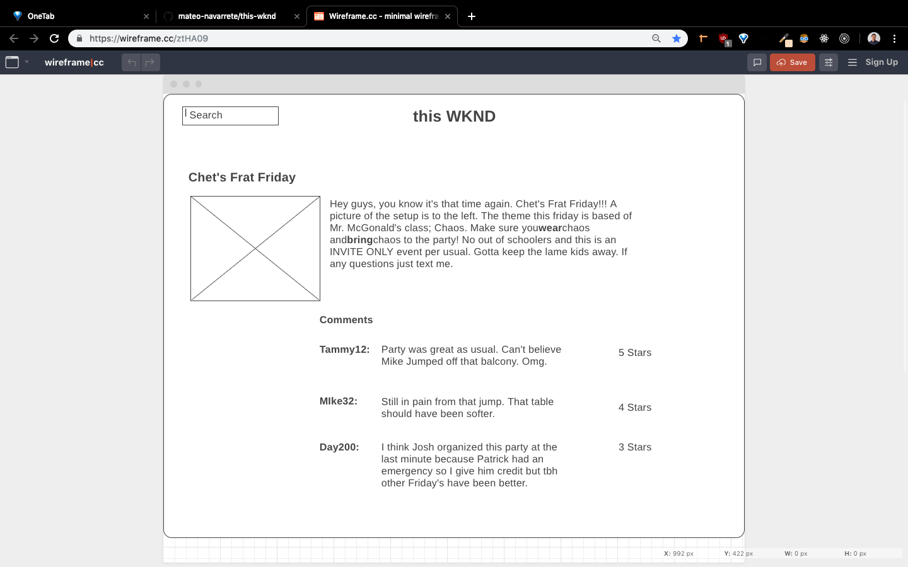

# v1_Wireframes

## 

TODO:  
FrontEnd Route URL: `/`  
BackEnd API Endpoint: `TBD`  
State: `{ loggedIn : false, user : 0 }`  
Actions: `TBD`  
Components:

```
TBD
```

---

## 

TODO:  
FrontEnd Route URL: `/:id`  
BackEnd API Endpoint: `/users/:id`  
State: `{ user_profile, name, age, borough, img, hosted, rating }`  
Actions: `TBD`  
Components:

```
TBD
```

---

---

## 

TODO:  
FrontEnd Route URL: `/:id`  
BackEnd API Endpoint: `/events/:id`  
State: `{ event_profile, description, comments, ratings, img, attendees }`  
Actions: `TBD`  
Components:

```
TBD
```

---
